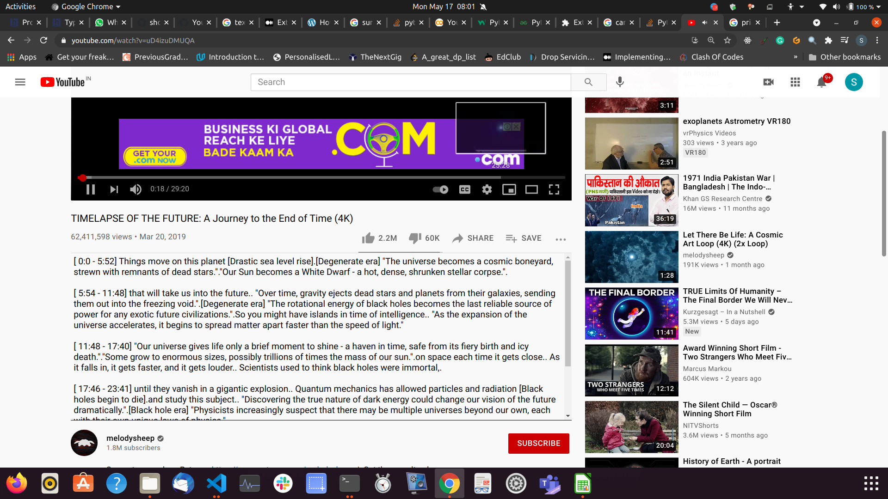

This is to help generate the summary of youtube videos.
The basic strategy it uses is using ML summarizing techniques on the transcript of the video.

The project is divided in two separate entities: 
1. client which is a chrome extension
2. server which process the request and sends it back to the client as a HTTP response.

The above structure is taken owing to implementation of Restful services.

### Installation:
1. Clone the repo.
2. Go in the server folder and create, activate a virtual environment and install the requirements
   with pip or pip3 install -r requirements.txt .If you can manage installing torch, else
3. Install these on google colab ,use [notebook](/server/Youtube_transcript_summarizer.ipynb) for assistance.
4. Make a account on [ngrok.com](https://ngrok.com/) and run the following cell with the auth token from [dashboard](https://dashboard.ngrok.com/get-started/setup)
    ```
    ! ngrok authtoken YOUR_AUTH_TOKEN
    from pyngrok import ngrok
    ngrok.kill()
    #LOCALHOST_PORT can be seen by first running the run and seeing the port in localhost  
    ngrok.connect(LOCALHOST_PORT)
    ```
5. Everything is done, run the app now. You can acess the website using the url provided above(change http to https in front of the url).
6. Also change the server link in [popup.js](/client/popup.js) file in get request to API.
7. Next load the chrome extension folder [client](/client) unpacked from [chrome://extensions/](chrome://extensions/).
   Go to [youtube](https://youtube.com/) and open a video and click on summarize and see the summary.
8. connect to ngrok each time app is run a new time.

### Server:
It is a simple flask app, which has a API /api/summarize?youtube_video='url' which can be used to get the summary of a
desired youtube video by simply making a GET XML HTTP request.

### Client:
It is a chrome extension which will render the summary of the youtube video below the youtube video player by making
use of the above API. Just click on summarize button and it will show the summary of the youtube video.

## Implementation Details:
### Server
The server side is implemented using flask as a restful service.
The summarization is done by first generating the transcript of the video
for which if the video has already transcript then it is used with the help of a python
library *youtube-transcript-api* ,otherwise first the audio is taken and speech to text transformation is done.
Again useful python libraries for used for this.

After this, the summary is generated using the transformers. As described here [Useful Blog](https://www.thepythoncode.com/article/text-summarization-using-huggingface-transformers-python), there are two ways to do this
1. Extractive summarization
2. Abstractive summarization

The length of the transcript short by applying *extractive summarization* with *bert model* and then the *T5 model* is used .

The summary is then given back as a HTTP response after one gives a GET HTTP request on */api/summarize?youtube_video="a valid url"*.

To server the request over HTTPS (as the youtube is a https website and generating a HTTP request to a http website will give a mixed content error), the app needs be to run on https rather than http, for this there can be two solutions -

1. A easy option is to use pyngrok (a wrapper library for ngrok), which allows to expose local host on a public url.
   It even gives https and http options for the url, so fulfills our purpose. This even allows to run the app on 
   environments like google colab where *localhost* won't be acessible. So, this is good for testing purposes.
   The colab notebook used for testing is added in server folder.
2. Another hard option is to deploy it on a host which will give the required https url and certificates.

Also, the CORS needed to be added as again if the HTTP request is headless then it would be blocked due to *CORS policy: No 'Access-Control-Allow-Origin' header is present on the requested resource.* So, CORS is simply allowed for all domains on all routes using the *flask_cors* library.

### Chrome-Extension
On clicking the summarize button on the popup, if the url is of form *https://www.youtube.com/watch?v=** the popup js makes a GET request to our *Server API* .A div element is added below the youtube player with a preload text.
Then, after the text is received, it is passed to the content js which then changes the content inside the above div element. Most of the properties are inherited from parent element, so that it fits perfectly there. Extra styling are added in [content.css](/client/content.css) <br>
It can be used by loading unpacked from [chrome://extensions/](chrome://extensions/).

### Improvements:
1. Presently, only basic setup is done. Exception handling is left, if the url is not correct. 
   This would not happen when using chrome extension but if used independently then it can occur.
   Some expections: The video is live, url is not correct.
2. Summarization needs to improved, if the content can be broken in some parts 
   and then summarization is done and that is given as time stamps.
   Sumy can be used.
3. The transcript is presently working only for youtube videos having captions on, the audio and text processing are left.
4. There can be extra features of choosing language and length of summary. There can be option to convert the text 
   to audio . 
5. The summary of some 10-15 minutes as time stamps can be given, then a person can also search for a keyword, when it
   is discussed and can go directly to that time .

